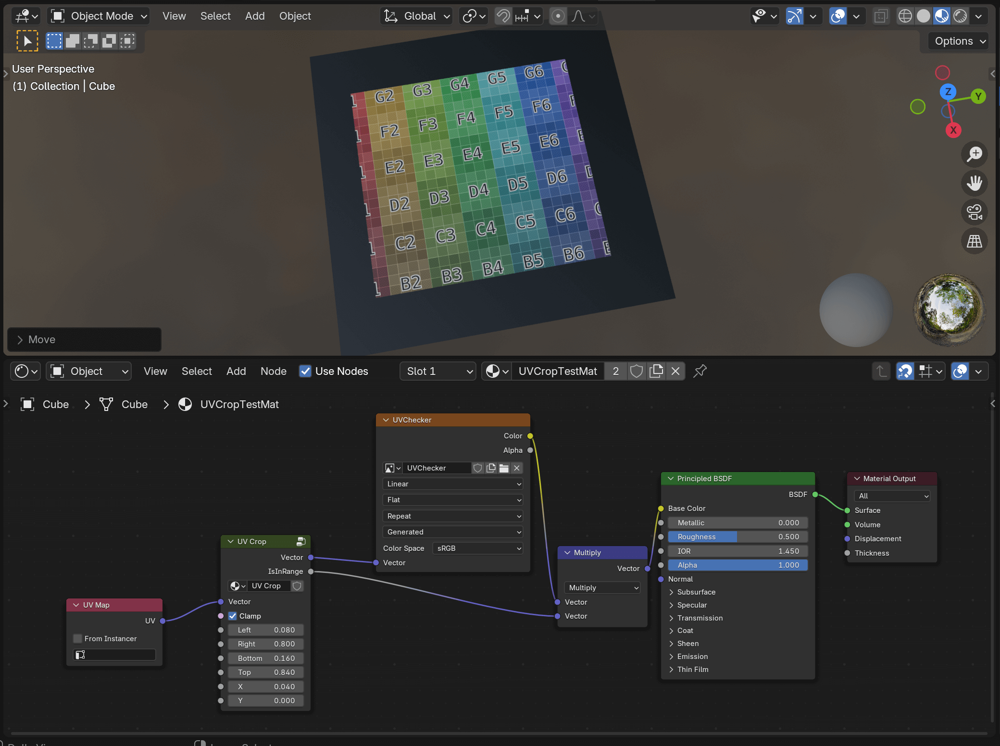
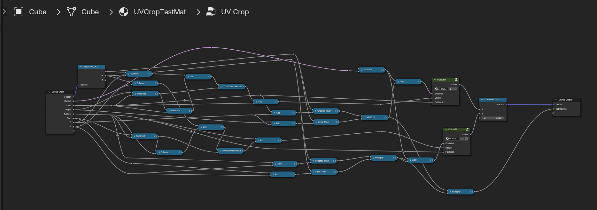

# UVCrop on Blender Shader Node

Note: Currently UVCrop node is contained in [UVCrop.blend](./UVCrop.blend) file, as a node group of shader node.

## TODO

- Installation Guide (as for now, please see [this thread on blender StackExchange](https://blender.stackexchange.com/questions/270632/how-can-i-save-a-node-group-for-later-use-without-going-through-a-blend-file), or simply "File > Append" [UVCrop.blend](./UVCrop.blend) into your blender file, or use something like [NodeShelf](https://anassezzahir.gumroad.com/l/nodeshelf))
- Make this into blender extension (addon)

## Acknowledgements

This is mainly based on the thread on Blender Artists. With some modification.

https://blenderartists.org/t/texture-image-crop-in-node-editor/1130537/17

## License

For detail, see [Acknowledgements](#acknowledgements). I think this can be Public Domain (in my opinion), but the original author is [`@Fallirini` (Tomáš Luža)](https://blenderartists.org/u/Fallirini)
