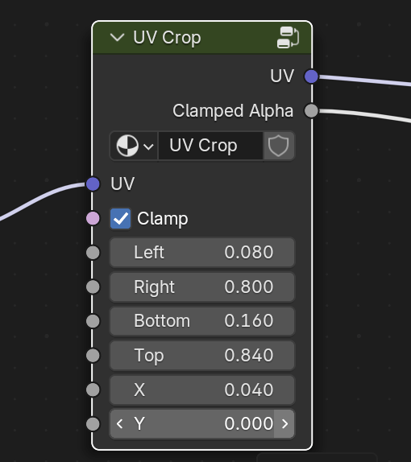

# UVCrop on Blender Shader Node

This node group named `UV Crop`, enables UV cropping and clamping (with clamped alpha output).

## Install

- Install [Node Presets](https://extensions.blender.org/add-ons/node-presets/) addon from blender extension.
- Copy [UVCrop.blend](./UVCrop.blend) file into your directory of Node Presets.
- You can now add `UV Crop` node by "Node > Add > Template > UV Crop".

## Usage

- Connect your UV vector into `UV` input.
- `Left` / `Right` / `Bottom` / `Top` indicates crop area (from 0 to 1. **Please note that blender coordiates is left-bottom based**.)
- You can move your texture by `X`, `Y`.
- You can toggle clamping by `Clamp`.
- `IsInRange` output can be used as alpha or white-black value indicates clamping area.

## Acknowledgements

This is mainly based on the thread on Blender Artists. With some modification.

https://blenderartists.org/t/texture-image-crop-in-node-editor/1130537/17

## License

For detail, see [Acknowledgements](#acknowledgements). The original author is [`@Fallirini` (Tomáš Luža)](https://blenderartists.org/u/Fallirini) . By checking [Terms of Service of blenderartists.org](https://blenderartists.org/tos), user contributions are basically licensed under a [Creative Commons Attribution-NonCommercial-ShareAlike 3.0 Unported License](https://creativecommons.org/licenses/by-nc-sa/3.0/deed.en), but please check Terms of Service by yourself.
