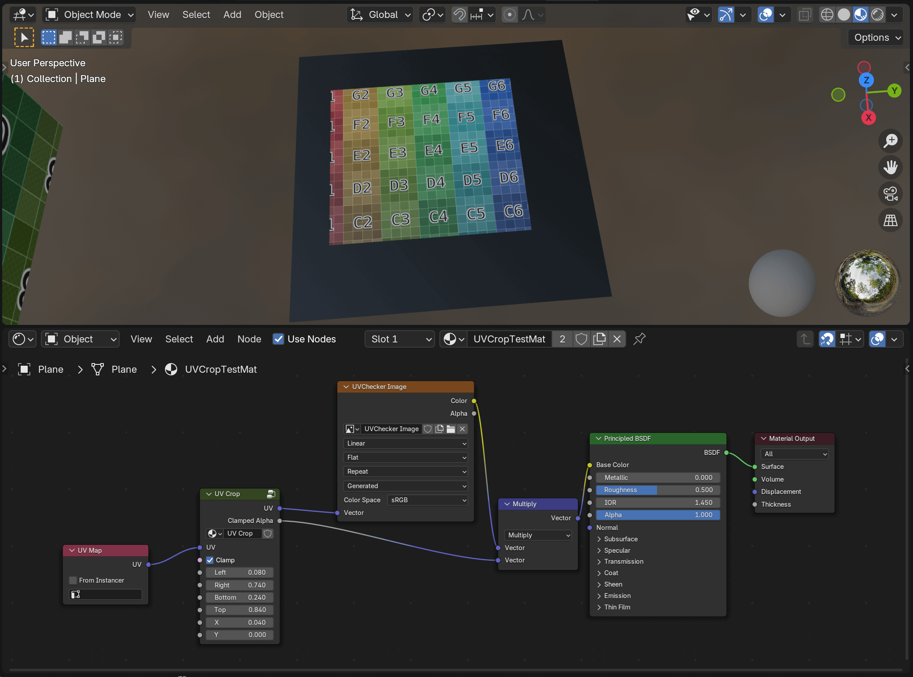

# UVCrop on Blender Shader Node

Note: Currently UVCrop node is contained in [UVCrop.blend](./UVCrop.blend) file.

## TODO

- Installation Guide
- Make this into blender extension (addon)

## Acknowledgements

This is mainly based on the thread on Blender Artists. With some modification.

https://blenderartists.org/t/texture-image-crop-in-node-editor/1130537/17

## License

For detail, see [Acknowledgements](#Acknowledgements). I think this can be Public Domain (in my opinion).